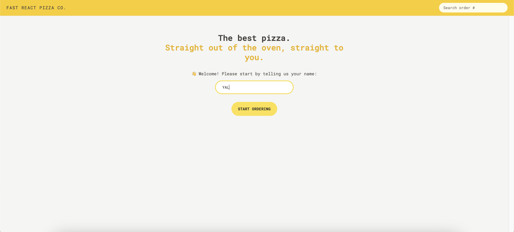
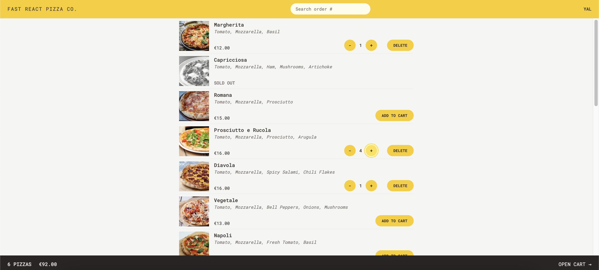
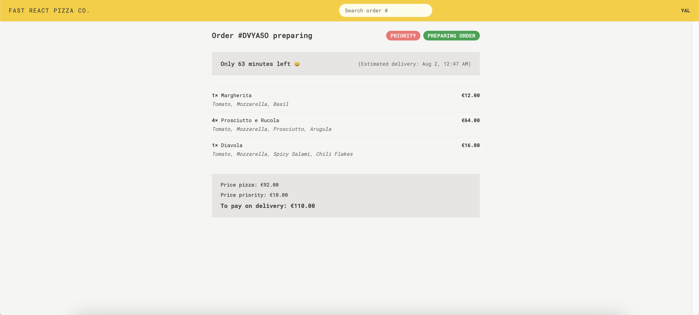

# Fast pizza order application - build with React + Vite

This is a web application built with React. After entering their name, users can access the menu page, place orders with a single click, modify quantities, and select orders for priority processing. Finally, by entering their phone number and address, they can complete the order. In the future, users can also use the order number to check the order status.

- Screenshot:
  
  
  

## Built with

- React
- Vite

## Runs the app

```Shell
npm run dev
```

- Runs the app in the development mode.
- Open [http://localhost:5173](http://localhost:5173) to view it in your browser.

- The page will reload when you make changes.
- You may also see any lint errors in the console.

## Links

- Live Site URL: [live site URL here]()

## Author

- The Ultimate React Course 2024: React, Redux & More by Jonas Schmedtmann
- My GitHub - [YACodingroom](https://github.com/YAcodingroom)

## Acknowledgments

- Ivy & Ciao
- YAL me
- Dr.Angela & Jonas
